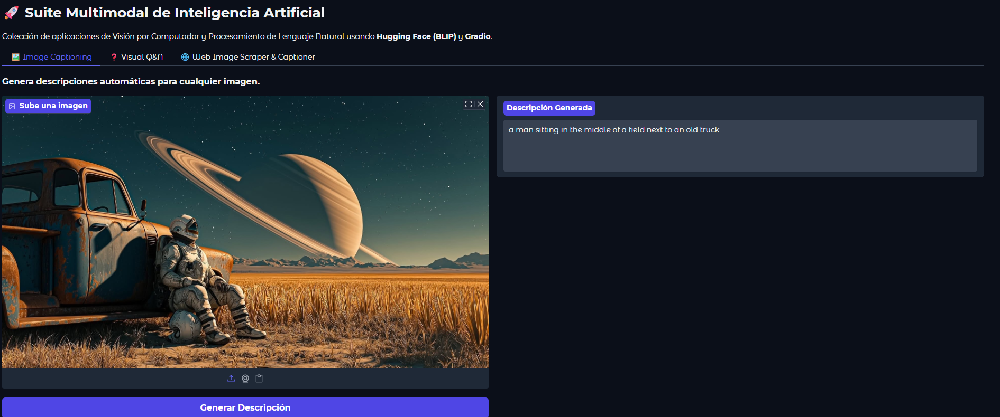
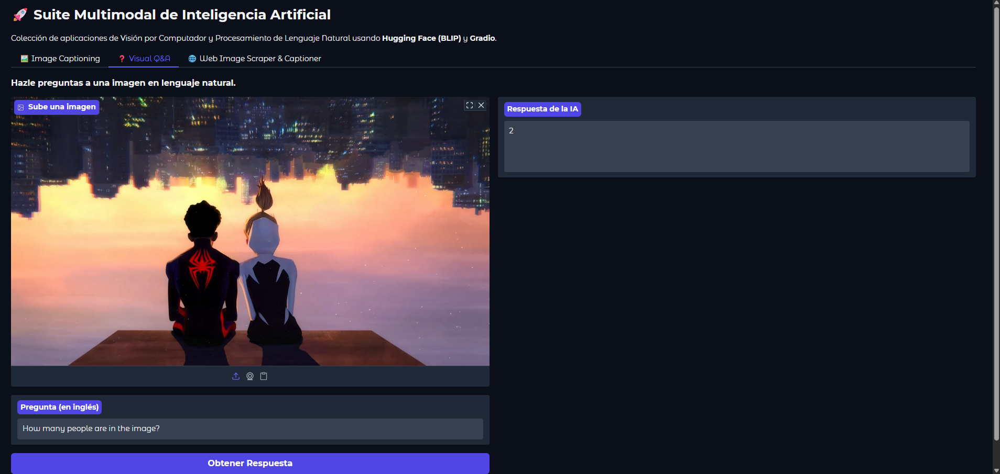
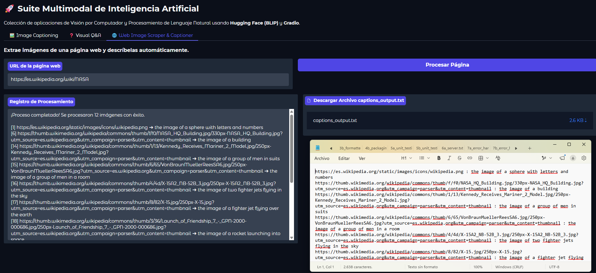

# 👁️ AI Vision Toolkit Web App


Una aplicación web interactiva multi-pestaña desarrollada en **Python** utilizando **Gradio**, **PyTorch** y **Hugging Face Transformers**. Integra modelos de visión por computadora (BLIP) para el procesamiento, análisis visual, generación de descripciones e inspección de imágenes desde URLs web con exportación automática de resultados.

---

## 🛠️ Módulos y Funcionalidades Principales

La aplicación consta de 3 herramientas especializadas integradas en una interfaz multi-pestaña:

### 📸 Pestaña 1: Generación de Subtítulos Simples (Image Captioning)
Permite cargar una imagen local y generar una descripción corta y concisa del contenido visual detectado por el modelo de visión.



---

### 🔍 Pestaña 2: Descripción Detallada y Análisis de Imágenes
Procesa la imagen para extraer detalles contextuales más profundos o responder a consultas específicas sobre la escena visual analizada.



---

### 🌐 Pestaña 3: Extracción e Inspección de Imágenes Web (con Exportación a `.txt`)
Herramienta de scraping e inspección visual que analiza todas las imágenes alojadas en una URL web, genera la descripción (*caption*) de cada una de ellas y permite **descargar un archivo `.txt`** con el listado estructurado de los enlaces de las imágenes y sus respectivos subtítulos.



---

## 📖 Guía de Uso de la Aplicación

### 1️⃣ Uso de la Pestaña 1 (Image Captioning)
1. Arrastra y suelta una imagen en el cuadro de carga o haz clic para seleccionar un archivo local (`.jpg`, `.png`, etc.).
2. Haz clic en el botón **Generar Subtítulo / Caption**.
3. Visualiza la descripción generada por el modelo en el recuadro de texto de salida.

### 2️⃣ Uso de la Pestaña 2 (Descripción Detallada)
1. Selecciona o sube la imagen que deseas analizar en detalle.
2. Ingresa parámetros o preguntas específicas sobre la imagen si lo requiere.
3. Presiona el botón de **Analizar / Generar Descripción**.
4. Revisa el desglose contextual extendido en el área de salida.

### 3️⃣ Uso de la Pestaña 3 (Inspección Web y Exportación `.txt`)
1. Ingresa la URL del sitio web que contiene las imágenes que deseas inspeccionar.
2. Haz clic en el botón de **Procesar URL / Inspeccionar**.
3. La aplicación extraerá las imágenes, las procesará con el modelo de visión y desplegará la vista previa con sus descripciones.
4. Presiona el botón **Descargar reporte (.txt)** para obtener un archivo de texto con el historial completo de URLs de las imágenes y sus correspondientes *captions*.

---


## 🛠️ Tecnologías Utilizadas

- **Lenguaje:** Python 3.10+
- **Interfaz Web:** Gradio (Multi-tab layout)
- **Modelos de IA & Visión:** Hugging Face Transformers, PyTorch
- **Procesamiento de Datos e Imágenes:** NumPy, Pillow (PIL)
- **Web Scraping / Peticiones:** Requests, BeautifulSoup4

---

## 💻 Instalación y Ejecución Local

1. **Clonar el repositorio:**
   ```bash
   git clone [https://github.com/Raul-coder07/ai-vision-toolkit-gradio.git](https://github.com/Raul-coder07/ai-vision-toolkit-gradio.git)
   cd ai-vision-toolkit-gradio
   ```

2. **Instalar las dependencias:**
   ```bash
   pip install -r requirements.txt
   ```

3. **Ejecutar la aplicación:**
   ```bash
   python app.py
   ```

4. **Acceder a la interfaz:**
   Abre tu navegador e ingresa a la dirección local indicada en la terminal (por defecto: `http://127.0.0.1:7860`).

